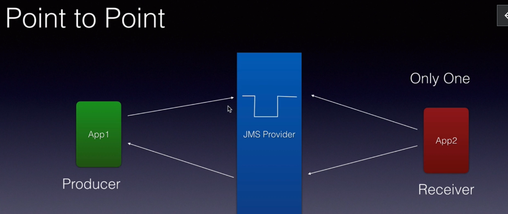
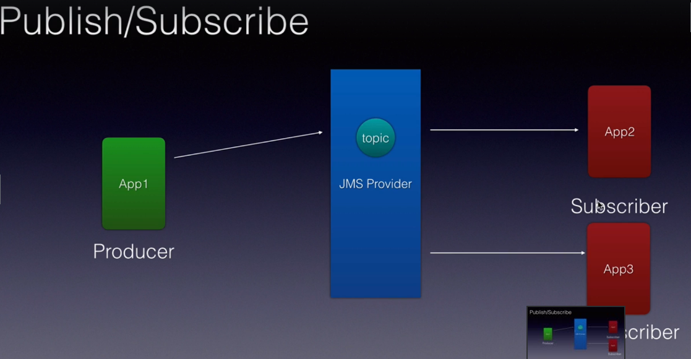

# JMS  

Como provider para o JMS utilizarei o Apache ACtiveMQ Artemis

- Point to Point 

Produce: Async fire and forget 
Receiver: Sync request and reply 

Ex: how e-mail works 

- Pub/Sub

Producer: Cliente envia msg para o topico 
Topic: JMS Provider (garante que todos os inscritos vão receber)
Subscriber: Pode ser mais de um a se 'inscrever' no Topico

Ex: newsletter - quando vc assina uma newsletter é garantido que todos os subs devem receber a mensagem que é enviada ao tópico pelo cliente. 

